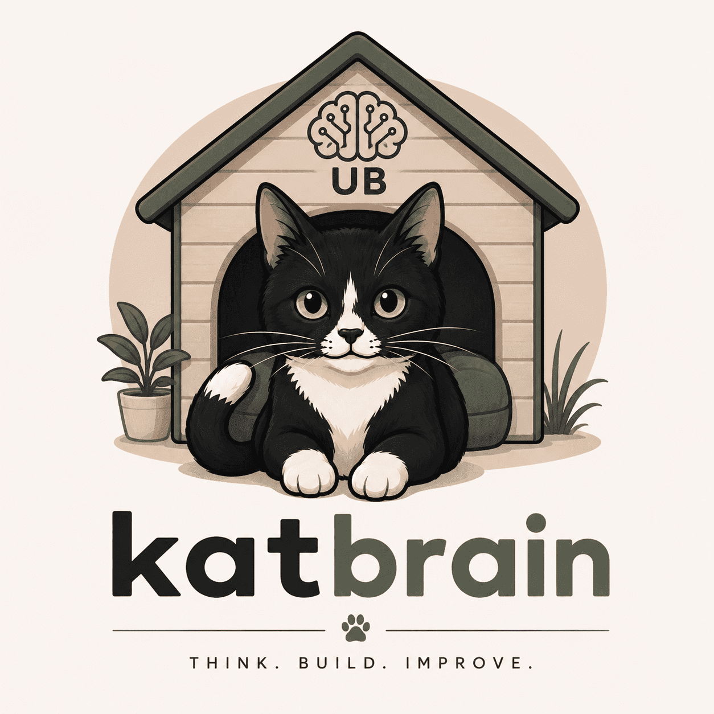

# 🧠 KatBrain

> Le second cerveau d'un développeur.

KatBrain est une base de connaissances personnelle dédiée au développement logiciel, à l'architecture, à l'infrastructure et à la documentation de projets.

Construit avec Hugo, il centralise les notes techniques, les retours d'expérience, les projets personnels et les décisions d'architecture dans un espace unique.

---

# Structure 

La structure définis est en cours de test, elle peut être amené à évoluer.

## Organisation 

Les notes sont organisées par domaine.

```
docs/
|-- Go/
|-- Hugo/
|-- Docker/
|-- Neovim/
```

Chaque domaine dispose d'un point d'entrée permettant de rendre visible le dossier dans le menu de gauche de la section. Ce fichier `_index.md` utilise un script pour afficher automatiquement un sommaire basé sur les notes et les titres de niveau.

---

## Hiérarchie 

### Niveau 1: Domaine 

Exemple : 

- Go 
- Docker 
- SQL 

### Niveau 2: Concept 

Exemple:

```
Go/
|-- Language/
|-- Concurrency/
|-- Error-Handline/
```

### Niveau 3: Note 

```
Language/
|-- Struct.md 
|-- Slice.md
```

---

## Convention de nommage 

- **Une note = un sujet** 
- Utilisation de nom court

---

## Type de notes 

### Concept 

Explique un mécanisne, une notion 

- Interface 
- Slice 
- Goroutine 

Tag: `concept` 

### Guide 

Décrit une procédure 

- Installation Hugo 
- Déploiement Coolify 

Tag: `guide`

### Troubleshooting 

Documente un problème rencontré

- Symptôme 
- Cause 
- Solution 

Tag: `troubleshooting`

### Architecture 

Documente un choix de conception 

Tag: `architecture`

---

## Workflow de création 

Lorsqu'un nouveau sujet apparaît: 

1. Identifier le domaine 
2. Identifier le concept principal 
3. Créer une note dédiée 
4. Ajouter un tag 

---

## 🐾 Explorer

### 📚 Technologies

- Go
- Hugo 
- Neovim 

### 🚀 Projets

- KatMail
- Portfolio

### 🏗️ Infrastructure

- Coolify

---

## 🎯 Mission

Accumuler des connaissances est simple.

Les organiser, les documenter et les retrouver plusieurs mois plus tard est beaucoup plus difficile.

KatBrain est conçu pour devenir un référentiel durable regroupant :

- des notes techniques
- des guides pratiques
- des schémas d'architecture
- des retours d'expérience
- des documentations de projets

---

> Think. Build. Improve. 🐾
