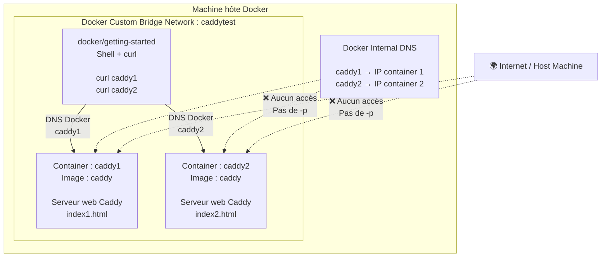

# Docker 

## Container 

Le container contient l'application et toutes les dependances. C'est l'unite de base.
C'est une instance d'une image. Cette image est en actively running

Chaque container est une instance qui contient un environnement isoler.

### `docker run` - Lancer un container 

```shell
# run container 
docker run -d -p hostport:containerport namespace/name:tag
docker run -d -p 8965:80 docker/getting-started:latest

docker run -d -e NODE_ENV=development -e url=http://localhost:3001 -p 3001:2368 -v ghost-vol:/var/lib/ghost ghost

docker run -d --name caddy1 --network caddytest -v $PWD/index1.html:/usr/share/caddy/index.html caddy
```

- `-d`: detached mode 
- `-p`: forwading de port
- `hostport`: port sur la machine local 
- `containerport`: port dans le container 
- `namespace/name`: nom de l'image a lancer 
- `tag`: la version de l'image 
- `-e NODE_ENV=development`: permet de set une variable d'envrionnement
- `-v <VOLUME_LOCAL>:<VOLUMER_CONTAINER>`: set un volume pour le container. Si le volume n'existe pas il sera creer
- `--name <NAME_CONTAINER>`: permet de nommer un container
- `--network <NETWORK_NAME>`: permet d'associer a un network 

### `docker ps` - lister les containers

```shell
# list les containers en cours d'execution
docker ps 

# list tous les containers meme ceux stopper
docker ps -a
```

### `docker stop` - stopper un container 

Il existe deux maniere de stopper un container :
- `docker stop`: la maniere propre
- `docker kill`: si la commande normal ne stop par le container 

```shell
docker stop <CONTAINER_ID>
```

### `docker rm` - supprimer un container

```shell
docker rm <CONTAINER_ID>

# supprimer tous les containers 
docker container prune -f

# stop all and remove 
docker container stop $(docker container ls -aq)
docker container prune -f
```

## Volume 

Par defaut, les conteneur ne conserve pas de donnees. A chqaue redemarrage, les donnees sont supprimer.
Le container est "reset" sur l'etat de l'image.

Docker fournis des volumes, permettant de conserver les donnees d'un container. 

### `docker volume create` - creation d'un volume 

```shell
docker volume create <VOLUME_NAME>
```

### `docker volume ls` - lister les volumes 

```shell
docker volume ls
```

### `docker volume inspect` - inspecter un volume 

```shell
docker volume inspect <VOLUME_NAME>

# sortie exemple
[
    {
        "CreatedAt": "2026-07-10T11:12:01+02:00",
        "Driver": "local",
        "Labels": null,
        "Mountpoint": "/var/lib/docker/volumes/ghost-vol/_data",
        "Name": "ghost-vol",
        "Options": null,
        "Scope": "local"
    }
]
```

### `docker volume rm` - supprimer des volumes

```shell
docker volume rm <VOLUME_NAME>

# supprimer tous les volumes
docker volume prune
```


## Image 

L'image est la definition du container.

### `docker pull` - telechargement d'une image 

Cette commande permet de telecharger une image depuis le Docker Hub

```shell
docker pull <IMAGE_NAME>
```

---

## Help 

Permet d'avoir le manuel des commandes Docker.

```shell
docker help
docker --help
docker -h #depreceated

# manuel d'une commande
docker <COMMANDE> -h
docker build -h
```

---

## Exec 

Permet d'acceder au terminal dans le container.

```shell
# lance la commande ls dans le container
docker exec <CONTAINER_ID> ls

# acces au terminal dans le container 
docker exec -it <CONTAINER_ID> /bin/sh

# quitter la session terminal 
exit
```

- `-i`: passe `exec` en terminal interactif 
- `-t`: permet d'acceder au tty
- `/bin/sh`: donne acces a la session shell dans le container 

---

## Network 

### `--network none` - container sans reseau 

```shell
docker run --network none

# exemple
docker run -d --network none docker/getting-started
```

Cette commande permet de lancer un container Docker sans network. Le container sera totalement isoler de la machine local.

Dans les cas ou l'on veux travailler sur des choses non sur.

### `docker network create` - creation d'un network 

```shell
docker network create <NETWORK_NAME>
```

### `docker network ls` - lister les network 

```shell
docker network ls
```

### Load Balancer

Un **Load Balancer** est un "serveur central" qui permet de diriger les requetes vers un serveur qui peut supporter la charge entrante.

Il vient diriger les requetes vers un serveur en capacite de traiter cette requete.

`Caddy` est une application open source servant de Load Balancer et de serveur web. C'est un remplacant moderne pour Apache et Nginx

#### Mise en place 
```shell
# telechargement de l'image docker 
docker pull caddy 

# lancement du container
# le fichier sera retourner par le serveur caddy
docker run -d -p 8881:80 -v $PWD/index1.html:/usr/share/caddy/index.html caddy
```

### Custom Network 

Permet de rendre accessible uniquement un point d'entree. Les autres container ne sont pas accessible depuis l'exterieur

```shell
# creation d'un network 
docker network create caddytest

# list des network pour checker si bien creer
docker network ls 

# lancement des container 
docker run -d --name caddy1 --network caddytest -v $PWD/index1.html:/usr/share/caddy/index.html caddy
docker run -d --name caddy2 --network caddytest -v $PWD/index2.html:/usr/share/caddy/index.html caddy

# test ping depuis un container interne
docker run -it --network caddytest docker/getting-started /bin/sh
curl caddy1
curl caddy2
```



---

## Dockerfile 

