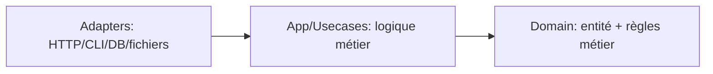
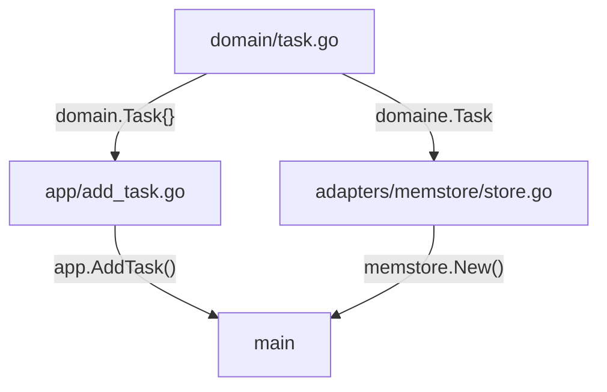

## Couches: `domain` - `app/usecases` - `adapters` 

Les couches permettent d'organiser le code. Il est grouper par rôle, et les dépedances sont orientées de l'intérieur vers l'exterieur. 

Le compilateur participe à cette dicipline via les `imports`. Cela indique que l'on accepte de dépendre de l'API de quelqu'un d'autre au niveau de la compilation. 

- `domain`: contient les données métiers et règles (entité, invariants)
- `app` / `usecases`: opérations au niveau de l'application (créer une tâches, trouver une tâches) 
- `adapters`: implémentations concrete: mémoire, fichier, base, enveloppe CLI, enveloppe HTTP

Les `app/usecases` peuvent être branché sur une CLI, un serveur HTTP ou sur les tests car ils viennent communiquer avec le monde extérieur via des interfaces, et non via des packages d'implémentations concrets. 

### Direction des dépendances: l'exterieur connait l'intérieur 

Les dépendances sont dirigées de l'extérieur vers l'intérieur. La CLI/HTTP/Stockage connaissent `app` et `domain`, les scénarios connaissent `domain`, et `domain` ne connait personne. Il existe et respecte ses propre règles.



### Import 

En Go, l'impot n'est pas juste "donne moi une fonction". Lorsque l'on importe un package, on commence à dépendre de son API exportée. C'est un vrai contrat pratique qu'il est difficile de modifier sans conséquence.

Les couches permettent de réduire le nombre de couche de dépendances. Par exemple, si la couche CLI dépend de `app`, alors le changement dans la cLI ne devrait pas obliger à réecrire le domaine. Et si le domaine se met à dépendre de la CLI, on créer une dépendance sur le texte d'aide du terminal.

### Exemple: Architecture d'une app 

On créer une application de Todo.

Cette structure permet de faire apparaitre le rôle des chaque couches.

```tree
tasker/
  go.mod                  (module example.com/tasker)
  main.go
  domain/         -> entités
    task.go
  app/            -> logique métier 
    add_task.go
  adapters/       -> "controller"
    memstore/
      store.go
```



#### Couche Domain

Le domaines contient: 
- les entités (`User`, `Task`, `Order`)
- les règles métiers fondamentales 
- des méthodes sur ces entités 

Dans la couche `domain`, on place ce que l'on souhaite conserver même en dehors du terminal, sans serveur, sans fichier de base de données.

Si demain la CLI disparait, le domaine doit quand même décrire le domaine métier. Dans le domaine, on garde la struct `Task` et une rêgle minimal 

```go 
// domain/task.go
package domain

import "errors"

// déclaration d'erreur 
// exportée car elle peut étre utile dans une autre couche
var ErrEmptyTitle = errors.New("empty title")

// déclaration du modèle 
type Task struct {
	ID    int
	Title string
	Done  bool
}

// déclaration d'une règles métier
// on vérifie la présence du titre 
func NewTask(id int, title string) (Task, error) {
	if title == "" {
		return Task{}, ErrEmptyTitle
	}
	return Task{ID: id, Title: title}, nil
}
```

#### Couche App/Usecases

C'est l'équivalent du service

C'est le coeur fonctionnel de l'application. 
- Créer une tâche 
- Valider une commande 
- Authentifier un utilisateur 
- Générer un rapport 

Il ne sait pas comment les données sont stockées, ni si l'appel provient d'une api HTTP, d'une CLI. Il exécute juste la logique métier

Un scenario c'est "ce que l'application fait" mais sans les détails du comment elle stocke les données, si par quelle surface l'utilisateur clique.

On vient décrire l'opération d'ajout d'un tâche. On as besoin d'une dépendance: l'endroit où est stocker la donnée mais on ne souhaite pas tirer une impléementation concrète directement dans le scénario.

Le scénario déclare une interface: le contrat minimal dont il a besoin.

On viens importer le `domain`, mais pas d'adapteur. Cela permet ensuite de brancher n'importe quelle implémentation de `TaskStore`. 
```go 
//app/add_task.go 
package app

import (
	"context"
	"fmt"

	"example.com/tasker/domain" // import du domaine
)

// implémentation de l'interface 
type TaskStore interface {
	NextID(ctx context.Context) (int, error)
	Save(ctx context.Context, t domain.Task) error
}

// méthode pour l'ajout d'une nouvelle task 
func AddTask(ctx context.Context, store TaskStore, title string) (domain.Task, error) {
	id, err := store.NextID(ctx)
	if err != nil {
		return domain.Task{}, fmt.Errorf("next id: %w", err)
	}

	t, err := domain.NewTask(id, title)
	if err != nil {
		return domain.Task{}, err
	}

	if err := store.Save(ctx, t); err != nil {
		return domain.Task{}, fmt.Errorf("save task: %w", err)
	}
	return t, nil
}
```

#### Couche Adapter 

C'est dans cette couche que l'on vient définir les détails. Par exemple, le stockage en mémoire. Cette couche permet de satisfaire l'interface.

C'est l'équivalent d'un controller.

Le repository est également un adapter -> c'est lui qui s'occupe de la connection avec la DB

Contients: 
- Handler HTTP (`GET /tasks`, `POST /users`)
- Interface CLI 
- Accès base de données 
- Lecture / Ecriture de fichier 

C'est le pont entre le monde extérieur et l'application.

```go 
// adapters/memstore/store.go
package memstore

import (
	"context"

	"example.com/tasker/domain" // importe le domaine pour le stockage de l'entité du domaine
)

// création d'un store pour stocker les donnees en mémoire 
type Store struct {
	next int
	data map[int]domain.Task
}

// initialisation de la mémoire 
func New() *Store {
	return &Store{next: 1, data: make(map[int]domain.Task)}
}

// méthode pour implémenter l'interface
func (s *Store) NextID(ctx context.Context) (int, error) {
	id := s.next
	s.next++
	return id, nil
}

func (s *Store) Save(ctx context.Context, t domain.Task) error {
	s.data[t.ID] = t
	return nil
}
```

#### `main`

C'est sur cette couche que l'on vient créer l'assemblage. C'est le point d'entrée de l'application et où l'on vient relier les détails.

```go 
// main.go 
package main

import (
	"context"
	"fmt"

	"example.com/tasker/adapters/memstore" // import Adapter
	"example.com/tasker/app" // import App 
)

func main() {
  // création du store -> import depuis Adapter 
	store := memstore.New()

  // création d'une task -> méthode de App
	t, err := app.AddTask(context.Background(), store, "read Go book")
	if err != nil {
		fmt.Println("error:", err)
		return
	}

	fmt.Printf("added: #%d %s\n", t.ID, t.Title) // added: #1 read Go book
}
```

---

## 28-1: `internal/`

