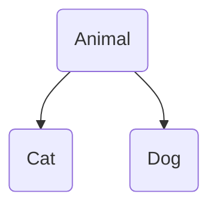

---
---

## Héritage 

Mécanisme qui permet de créer une nouvelle classe à partir d'une classe existante en héritant de ses propriétés et méthodes.

La nouvelle classe s'apelle une sous-classe, ou classe dérivée et la classe d'origine la classe parent ou classe de base.



Par exemple, la classe `Animal` est la classe parent qui contient des méthodes de base. Les deux classes enfant `Cat` et `Dog` viennent hérité de la classe parent, et peuvent étendre avec les méthodes et props respective.

L'héritage permet:
- **Réutilisation du code**: tout ce qui est commun est extrait dans une classe de base. Cela permet de réduire la duplication de code.
- **Extension et spécialisation**: on peut ajouter de nouveaux champs et méthodes ou modifier les existants.
- **Structuration des hiérarchie**: le code devient plus logique et lisible.

La sous classe hérite:
- Champs et méthodes `public` et `protected` de la classe de base
- Les membres `package-private` si la sous-classe est dans le même package

Elle n'hérite pas:
- des constructeurs: ils doivent être déclarée explicitement dans la sous classe
- des champs et méthodes `private`
- des blocs d'initialisation statique

---

### Syntaxe 

```java
// Classe parente
class Animal {
    String name;

    void eat() {
        System.out.println(name + " mange.");
    }
}

// Sous-classe
class Cat extends Animal {
    void meow() {
        System.out.println(name + " dit: Miaou!");
    }
}
```

`Cat` hérite des champs et méthodes de la classe `Animal`. La classe `Cat` dispose également de sa propre méthode `meow()`

On peut ensuite venir utiliser cette classe: 

```java
public class Main {
    public static void main(String[] args) {
        Cat kitty = new Cat();
        kitty.name = "Buddy";
        kitty.eat();      // Buddy mange.  (hérité)
        kitty.meow();     // Buddy dit: Miaou! (méthode propre)
    }
}
```

---

## Contrainte de l'héritage 

**Un seul héritage de classes**: chaque classe peut hériter que d'une seule autre classe. Une classe peut avoir autant de descendants que nécessaire.

**La classe `Object`: ancêtre de toutes les classes en Java. Chaque classe hérite explicitement de `Object`

---

## Constructeurs et héritage 

Les constructeurs ne sont pas hérités. Si on ne définis pas de constructeur dans la sous-classe, Java ajoute automatiquement un constructeur sans paramètres (s'il existe chez le parent).

Si la classe parent n'a qu'un constructeur avec paramétres, il faudras l'appeler dans la sous-classe avec `super()`

```java
class Animal {
    String name;
    Animal(String name) {
        this.name = name;
    }
}

class Cat extends Animal {
    Cat(String name) {
        super(name); // on appelle le constructeur du parent
    }
}
```

---

## `@Override`: redéfinition de méthodes

La redéfinition de méthode c'est lorsqu'une sous classe fournit sa propre implémentation d'une méthode déjà déclarée dans la classe parent. Elle remplace le comportement standard par le sien plus spécifique.

Pour redéfinir la méthode, il faut déclarer dans la classe enfant une méthode avec exactement la même signature (nom, paramètres et type de retour).


L'annotation `@override` permet de marquer des méthodes redéfinie. Cela permet :
- le compilateur vérifie que l'on redéfinie bien la méthode du parent
- améliore la lisibilité du code 

Lorsque l'on appelle une méthode sur un objet d'une sous classe, c'est la méthode de la sous classe qui est utilisée.


```java
class Animal {
    void makeSound() {
        System.out.println("Some generic animal sound");
    }
}

class Dog extends Animal {
    @Override // redéfinition de la méthode
    void makeSound() {
        System.out.println("Woof!");
    

class Cat extends Animal {
    // On redéfinit la méthode makeSound()
    void makeSound() {
        System.out.println("Meow!");
    }
}

// UTILISATION 
Animal animal = new Dog();
animal.makeSound(); // "Woof!", et non "Some generic animal sound"
```

### Règles et limitations 

**Signature de méthode**
- Le nom, le type, et l'ordre des paramètres doivent correspondre à la méthode la classe parent 
- Le type de retour doit être identique ou covariant. Par exemplem si la parent retourne `Animal` et l'enfant retourne `Dog` c'est autorisé 

**Modificateur d'accés**
- On ne peut pas rendre l'accès plus strict 
- Si la méthode parent utilise `public`, la méthode redéfinie doit aussi être `public`
- Si la méthode parent utilise `protected`, la méthode redéfinie peut être `protected` ou `public`

**Exception**
- La méthode redéfinie ne peut pas lancer une nouvelle exception contrôlée qui n'est pas déclarée dans le parent 
- Elle peut lancer moins d'exceptions que le parent, ou des sous types de celle ci 

**`static`, `final`, `private`**
- on ne peut pas redéfinir les méthodes `static` ou `final` 
- `static` correspond à un masquage
- `final` ne peut pas être redéfinis
- `private` n'est pas visible dans la classe enfant, on ne peut pas la redéfinir

**Constructeur**
Les constructeurs ne sont ni hérité, ni redéfinis. Chaque classe dispose de ses propres constructeurs.

---

## `super`: appel du constructeur et méthode de la classe parent 

Lorsque l'on créer une sous classe, il arrive parfois que l'on ai besoin d'accéder aux champs et méthodes de la classe de base, en particulier si on est les as `@override` ou masquées dans la sous classe.

`super` permet depuis une sous classe d'indiquer explicitement que l'on souhaite accéder à ce qui est définit dans la classe parent. 

### Accès aux méthode de la classe parent

```java
class Animal {
    void eat() {
        System.out.println("L'animal mange");
    }
}

class Cat extends Animal {
    @Override
    void eat() {
        System.out.println("Le chat renifle la nourriture...");
        super.eat(); // on appelle la méthode eat() d'Animal
        System.out.println("Le chat ronronne, satisfait");
    }
}
```

- lorsque `eat()` est appelé sur un objet `Cat`, le code de la méthode de la sous classe est appelé.
- dans cette méthode, on vient appeler la méthode de la classe parent avec `super.eat()`

### Accès aux champs de la classe parent 

Si dans une sous classe, on déclare un champ portant le même nom que dans la classe parent, il masque celui de la classe parent. 

Pour accéder au champ de la classe parent, il faut utiliser le `super`

```java
class Animal {
    String name = "Animal";
}

class Cat extends Animal {
    String name = "Chat"; // masquage

    void printNames() {
        System.out.println("Nom depuis Cat : " + name);
        System.out.println("Nom depuis Animal : " + super.name); // affichage du champ parent
    }
}
```

### Appel du constructeur parent 

Lorsque l'on vient créer un objet d'une sous classe, **le constructeur de la classe parent est appelé en premier puis celui de la classe enfant**.
Cela permet d'initialiser les champs, puis la sous classe hérite d'une partie de l'état du parent.

Si la classe de base possède un constructeur sans paramètrem Java l'appelle avant d'éxécuter le constructeur de la classe enfant. Si le parent n'as pas de constructeur sans paramètre, il faut venir explicitement appeler le constructeur avec `super`.

L'appel au constructeur parent doit être la première ligne du constructeur de la sous classe.

```java
class Animal {
    String name;

    // constructeur parent avec paramètre
    Animal(String name) {
        this.name = name;
        System.out.println("Animal créé : " + name);
    }
}

class Cat extends Animal {
    Cat(String name) {
        // appel du constructeur parent
        super(name); // obligatoire ! Pas de constructeur Animal() sans paramètre
        System.out.println("Chat créé : " + name);
    }
}
```

---

## Hiérarchie de classe

Une hiérarchie est une structure arborescente où l'on trouve des entités général en haut de l'arbre (classe de base) et plus bas des entités plus spécifique.

En Java, une hiérarchie se contrat à l'aide de l'héritage: chaque sous classe peut elle-meme être le parent d'autres sous classe.

- `Animal` est une classe de base, en haut de l'arbre
- `Mammal` (mammifère) est un cas particulier d'animal
- `Dog` est une classe particulière de `Mammal`
- `Rex` est un objet de la classe `Dog`

```java
class Animal { }
class Mammal extends Animal { }
class Dog extends Mammal { }
```

```
Animal
├── Mammal
│   ├── Dog
│   └── Cat
└── Bird
    └── Sparrow
```

### Conception de hiérarchie: logique et pratique 

**Identifier le général et le spécifique**
La classe de base soit contenir ce qui est caractèristique de tous ses descendants. Tout ce qui est unique doit être reporté dans les sous-classe.

- Tous les animaux peuvent respirer et manger: les méthodes `breathe()` et `eat()` doivent être dans la classe `Animal`
- Seul les oiseaux savent voler: la méthode `fly()` sera dans la classe `Bird`, pas dans `Animal`
- Seuls les chients savent aboyer: la méthode `bark()` sera dans la classe `Dog`

```java
// Classe de base
class Animal {
    String name;

    Animal(String name) {
        this.name = name;
    }

    void eat() {
        System.out.println(name + " mange.");
    }

    void makeSound() {
        System.out.println(name + " émet un son.");
    }
}

// Sous-classe : Mammifère
class Mammal extends Animal {
    Mammal(String name) {
        super(name);
    }

    void feedMilk() {
        System.out.println(name + " nourrit ses petits avec du lait.");
    }
}

// Sous-classe : Chien
class Dog extends Mammal {
    Dog(String name) {
        super(name);
    }

    @Override
    void makeSound() {
        System.out.println(name + " aboie: Ouaf-ouaf!");
    }

    void wagTail() {
        System.out.println(name + " remue la queue.");
    }
}

// Sous-classe : Chat
class Cat extends Mammal {
    Cat(String name) {
        super(name);
    }

    @Override
    void makeSound() {
        System.out.println(name + " miaule: Miaou!");
    }

    void purr() {
        System.out.println(name + " ronronne.");
    }
}

// Sous-classe : Oiseau
class Bird extends Animal {
    Bird(String name) {
        super(name);
    }

    void fly() {
        System.out.println(name + " vole.");
    }

    @Override
    void makeSound() {
        System.out.println(name + " pépiaille: Cui-cui!");
    }
}
```

On retrouve ce code dans le `main`

```java
public class ZooDemo {
    public static void main(String[] args) {
        Dog sharik = new Dog("Rex");
        Cat murka = new Cat("Fluffy");
        Bird sparrow = new Bird("Moineau");

        sharik.eat();        // Rex mange.
        sharik.makeSound();  // Rex aboie: Ouaf-ouaf!
        sharik.feedMilk();   // Rex nourrit ses petits avec du lait.
        sharik.wagTail();    // Rex remue la queue.

        murka.eat();         // Fluffy mange.
        murka.makeSound();   // Fluffy miaule: Miaou!
        murka.feedMilk();    // Fluffy nourrit ses petits avec du lait.
        murka.purr();        // Fluffy ronronne.

        sparrow.eat();       // Moineau mange.
        sparrow.makeSound(); // Moineau pépiaille: Cui-cui!
        sparrow.fly();       // Moineau vole.
    }
}
```

### Bonne pratique 

**Ne pas abusez de l'héritage**
L'héritage est un outil pour les relations `is-a`. Si on peut dire "Le chat est un Animal", on utilise l'héritage. Si au contraire, 'un achat contient une queue', on utilise la composition.

**Eviter les hiérarchie trop profonde**
En général, 2-3 niveaux est suffisant pour la plupart des tâches

**Substituion de Liskov**
Si une sous classe ne peut pas être utilisé à la place de son parent, la hiérarchie est mal conçue

---


