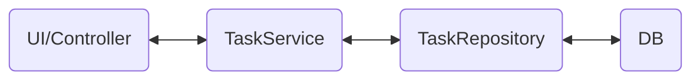

---
---

# Abstraction

L'abstraction est un processus qui consiste à dégager les caractéristiques et comportements communs d'un groupe d'objets, tout en ignorant les détails spécifique. 

En POO, l'abstraction consiste à créer des classes et des interfaces qui ne reflètent que les propriétés et actions imoprtantes pour la tâche, en masquant les détails superflues.

En Java, l'abstraction s'appuie sur les classes abstraites et les interfaces.

## Classes

Une classe abstraite est une classe qui ne peut pas être instanciée directement mais que l'on peut hériter. Une telle classe peut contenir des méthodes ordinaires et des méthodes abstraite.

Une méthode abstraite est une méthode sans corps. Elle est déclarée avec le mot clé `abstract` et doit obligatoirement être implémentées dans les classe enfant.

La classe abstraite permet de définir une interface commune: elle indique quelles méthodes doivent obligatoirement être implémentëes par toutes les sous-classes.

```java
// déclaration de la class abstraite 
// il n'est pas possible de l'instancier
public abstract class Animal {
    public abstract void makeSound(); // Méthode abstraite
}

// classe enfant issue de la classe abstraite 
public class Dog extends Animal {
    @Override
    public void makeSound() {
        System.out.println("Ouaf-ouaf!");
    }
}

public class Cat extends Animal {
    @Override
    public void makeSound() {
        System.out.println("Miaou!");
    }
}
```

### Quand utiliser une classe abstraite et quand une interface

- **Classe abstraite**: lorsque les objets ont un état commun (par exemple, des champs), une logique commune (méthode avec implémentation) et que l'on souhaite fournir un squelette de comportement avec possibilité d'extension
- **Interface**: lorsque l'on souhaite définir un ensemble de méthodes (un contrat).

Par exemple:
- `Oiseau`: classe abstraite: tous les oiseaux ont des becs, des ailes et peuvent voler
- `Volant`: interface -> non seulement les oiseaux peuvent voler mais aussi les avions, Ils volent tous différement mais l'essentiel est qu'ils savent le faire 

---

## Implémentation des abstractions et des hiérarchies

### Construire une hiérarchie

Implémenter des abstractions et des hiérarchies est une façon de structurer le code, des règles générales vers les détails concrets.
On commence par décrire ce que tous les objets doivent savoir faire (abstraction), puis on vient préciser comment chaque classe concrète le fait.

Par exemple: qu'est ce qu'on en commun un cercle et un rectancle ? Ce sont toutes les deux des formes. Elles ont une surface et on peut les dessiner.
En Java, on peut exprimer cela avec une classe `abstract`.

```java
public abstract class Shape {
    public abstract double area(); // la forme doit savoir calculer sa surface 
    public abstract void draw(); // la forme doit savoir se dessiner
}
```

On peut ensuite implémenter les classe enfants qui représente des formes concrète

```java
public class Circle extends Shape {
    private double radius;

    public Circle(double radius) {
        this.radius = radius;
    }

    @Override
    public double area() {
        return Math.PI * radius * radius;
    }

    @Override
    public void draw() {
        System.out.println("Nous dessinons un cercle de rayon " + radius);
    }
}

public class Rectangle extends Shape {
    private double width, height;

    public Rectangle(double width, double height) {
        this.width = width;
        this.height = height;
    }

    @Override
    public double area() {
        return width * height;
    }

    @Override
    public void draw() {
        System.out.println("Nous dessinons un rectangle " + width + "x" + height);
    }
}
```

- On extrait le commun dans une classe abstraite 
- On détaille le compotement dans les sous-classes

### Eviter la duplication 

Parfois, tous les héritiers ont des méthodes mais également des champs commun. La classe abstraite permet de stocker cela 

```java
public abstract class Figure {
    // champs commun aux enfant
    private double x, y; // coordonnées du centre

    public Figure(double x, double y) {
        this.x = x;
        this.y = y;
    }

    public void moveTo(double newX, double newY) {
        x = newX;
        y = newY;
        System.out.println("La figure a été déplacée au point (" + x + ", " + y + ")");
    }

    public abstract void draw();
}
```

---

## Simplification avec les abstractions 

Pour gérer des projets complexes, on viens décomposer le complexe en éléments simple, représenter par des niveau d'astraction.

Un niveau d'anbstration correspond généralement à une couche :
- **Interface utilisateur**: ce que voit l'utilisateur 
- **Logique métier**: règles et processus 
- **Accés aux données**: travail avec la base de données ou les fichiers.

Chaque couche travail avec des abstractions sans connaitre les détails des autres cocuhes. Par exemple, la logique métier n'as pas besoin de savoir comment l'interface utilisateur est implémentée ni comment les données sont stockées. Elle a seulement besoin de savoir qu'il existe des méthodes comme `saveOrder()` ou `finUserById()`

Par exemple, dans une application de todo, on peut identifier les abstractions:
- `Task`: description abstraite d'une tâche - une tâche à un titre, un status et des méthodes d'exécution 
- `TaskRepository`: abstraction pour le stockage des tâches 
- `TaskService`: logique métier: ajout de tâche, recherche, exécution 



Implémentation des classes abstraites et interface 

```java
// Couche de logique métier

// représente la task
public abstract class Task {
    private String title;
    private boolean completed;

    public Task(String title) {
        this.title = title;
        this.completed = false;
    }

    public abstract void complete();

    public String getTitle() { return title; }
    public boolean isCompleted() { return completed; }

    protected void setCompleted(boolean completed) { this.completed = completed; }
}

// Couche d’accès aux données (abstraction)
public interface TaskRepository {
    void save(Task task);
    Task findByTitle(String title);
    List<Task> findAll();
}
```

Implémentation de `Task`

```java
public class WorkTask extends Task {
    private String deadline;

    public WorkTask(String title, String deadline) {
        super(title);
        this.deadline = deadline;
    }

    @Override
    public void complete() {
        setCompleted(true);
        System.out.println("La tâche de travail '" + getTitle() + "' est terminée pour l'échéance " + deadline);
    }
}
```

Implémentation de `TaskRepository` qui contient les méthodes d'accès aux données => contient les méthodes de l'interface

```java
public class InMemoryTaskRepository implements TaskRepository {
    private List<Task> tasks = new ArrayList<>();

    @Override
    public void save(Task task) {
        tasks.add(task);
    }

    @Override
    public Task findByTitle(String title) {
        for (Task task : tasks) {
            if (task.getTitle().equals(title)) {
                return task;
            }
        }
        return null;
    }

    @Override
    public List<Task> findAll() {
        return new ArrayList<>(tasks);
    }
}
```

Implémentation de `TaskService` qui contient la logique métier

```java
public class TaskService {
    private TaskRepository repository;

    public TaskService(TaskRepository repository) {
        this.repository = repository;
    }

    public void addTask(Task task) {
        repository.save(task);
    }

    public void completeTask(String title) {
        Task task = repository.findByTitle(title);
        if (task != null) {
            task.complete();
        } else {
            System.out.println("Tâche introuvable : " + title);
        }
    }

    public void showAllTasks() {
        for (Task task : repository.findAll()) {
            System.out.println(task.getTitle() + " — " + (task.isCompleted() ? "terminée" : "non terminée"));
        }
    }
}
```

Implémentation dans la classe principale 

```java
public class Main {
    public static void main(String[] args) {
        // instanciation de la couche repository
        TaskRepository repo = new InMemoryTaskRepository();
        // instanciation du service
        TaskService service = new TaskService(repo);

        // création de nouvelles tasks
        service.addTask(new WorkTask("Rédiger le rapport", "2025-07-15"));
        service.addTask(new WorkTask("Préparer la présentation", "2025-07-16"));

        // affichage des tasks
        service.showAllTasks();

        // modification d'une task 
        service.completeTask("Rédiger le rapport");
        service.showAllTasks();
    }
}
```

- La classe principale `Main` ne sait pas comment est organisé le stockage des tâches - elle travaille avec l'abstraction `TaskRepository`
- `TaskService` ne sait pas quels type de tâches existent - il travail avec la classe abstraite `Task`
- Si on souhaite faire évoluer l'application avec une base de données, il suffit d'implémenter une nouvelle classe `DatabaseRepository`
- Si un nouveau type de tâche apparait, on ajoute une nouvelle classe enfant