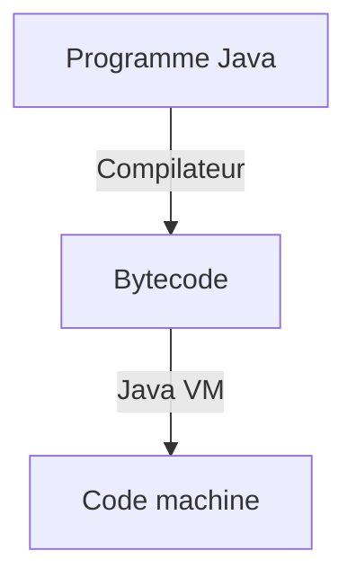

`main()` => point d'entrée du programme Java

```java
void main()
{
   // instructions de la méthode
}
```

## 1-2: Affichage à l'écran

```java
// affichage avec saut de ligne
System.out.prinln("Hello");

// affichage sans retour à la ligne
System.out.print("Hello");

// Affichage plusieurs valeurs
System.out.prinln("Mon Age: " + 28);
```

- `System.out`: objet système qui affiche du texte à dans la console.

## 1-3: intro variable

Chaque variable possède son type. Elle est constituée d'un **nom**, d'un **type**, et d'une **valeur**.

```java
// déclaration de variable
int a, b;
String s;
double c;

// affectation de variable => copie
a = 1;
s = "Hello";
c = 7.77;
```

Convention de nommage:

- Ne peux pas commencer par un chiffre
- Ne peut pas être un mot reservé
- Pas de caractère spécieux, sauf `$` et `_`
- La casse est significative
- On utilise le **camelCase**

## 1-4: Type de variables

Lors d'une concaténation entre une chaîne et un nombre, le nombre est automatiquement convertis en chaîne.

## 1-5: Compilateur

Java est un langage multiplateforme. Chaque classe est compilé séparément en code intermédiaire spéciale **bytecode**. La compilation en code machine s'effectue au lancement du programme.

Le programme Java Virtuel Machine (**JVM**) viens compiler le bytecode en code machine.



## Commentaire

```java
// commentaire one line

/*
  commentaire
  ligne
  multiple
*/
```

---

## 2-1: Int

`int` permet de stocker les nombres entiers.

```java
// déclaration
int x;

// déclaration multiple
int a, b, c;

// affectation
int y = 10;

// affectation multiple
int q = 7, z = 10;
```

| Type    | Taille, octet |
| ------- | ------------- |
| `byte`  | 1             |
| `short` | 2             |
| `int`   | 4             |
| `long`  | 8             |

## float

| Type     | Taille, octet |
| -------- | ------------- |
| `float`  | 4             |
| `double` | 8             |

### Opération arithmétique

#### Division de nombre entier

La division d'un nombre entier produit un entier. Le reste de la division est ignoré

```java
int a = 5 / 2; // 2
int b = 20 / 3; // 6
int c = -6 / 5; // -1
```

#### Modulo

Permet d'obtenir le reste d'une division.

Peut servir pour définir si un nombre est pair ou impair.

```java
int a = 5 % 2; // 1
int b = 20 % 4; //0

int pair = 4 % 2; // 0
int impair = % % 2; // 1
```

#### Incrémentation et décrémentation

```java
int x = 5;
x++; // 6
x--; // 5
```

---

## 2-2: String

Tous les objets Java peuvent être convertis en type `String`.

```java
String name = "Gizmo";

String name1, name2, name3;

String name = "Anya", city = "New York", message = "Hello!";
```

### `+`: concaténation

```java
String s1 = "Amigo" + " the best";

int x = 2025;
String s3 = "Amigo" + x;
```

### Chaîne vide

`""` représente une chaîne vide.

### Échappement de caractères

```java
String quote = "Il a dit: \"Bonjour!\"";
System.out.println(quote); // Il a dit: "Bonjour!"
```

- `\n`: saut de ligne
- `\t`: tabulation
- `\\`: échappement de `\`
- `\"`: échappement de `"`

### `str.length()`: longueur de chaîne

```java
String name = "Andrey";
int length = name.length();
System.out.println(length); // 6, car il y a 6 lettres
```

### `str.toUpperCase()`: conversion en majuscule

```java
String original = "Bonjour";
System.out.println(original.toUpperCase()); // BONJOUR
```

### `str.toLowerCase()`: conversion en minuscule

```java
String original = "Bonjour";
System.out.println(original.toLowerCase()); // bonjour
```

### `str.trim(0)`: supprimer les espaces en début et fin de chaîne

```java
String messy = "   hello   ";
System.out.println(messy.trim()); // "hello"
```

---

## 2-3: Conversion type et données

### Conversion int -> String

#### `String.valueOf()`: conversion int -> string

```java
int number = 42;
String str = String.valueOf(number);  // str == "42"
```

#### Concaténation avec une chaîne vide

```java
int number = 42;
String str = "" + number;
```

### Conversion String -> nombre

Pour convertir une chaîne en nombre, la chaîne ne doit contenir que des nombres.

#### `Integer.parseInt(string)`: convertis un int en String

```java
String str = "123";
int number1 = Integer.parseInt(str);        //  number1 contient le nombre 123;

int number2 = Integer.parseInt("321");      //  number2 contient le nombre 321

int number3 = Integer.parseInt("321" + 0);  //  number3 contient le nombre 3210

int number4 = "321"; //  Ne se compile pas : variable de type int, mais valeur de type String
```

---

## 2-4: Adresse mémoire et variables

### Organisation de la mémoire

Un programme est chargé en mémoire vive avant son exécution. La mémoire vive contient le code du programme (exécuté par le processeur), et les données du programme.

Le programme est ses données sont stockées en mémoire pendant l'exécutution. Toute la mémoire de l'ordinateur est représentée sous forme de "case", les octets. Chaque case possède sont numéro unique, la numérotation commence à zéro. Le numéro d'une case est appelé adresse de la case.

Le processeur sait exécuter les instructions d'un programme chargé en mémoire.

Lorsqu'une variable est déclarée dans le code du programme, un bloc mémoire libre est alloué. Lors de la déclaration d'une variable, il faut indiquer quel type la variable contient afin de définir une taille pour le bloc mémoire.

L'adresse d'une variable est l'adresse de la première case du bloc de mémoire qui lui est alloué

Les programme Java n'ont pas le droit d'accéder directement à la mémoire. Toute la manipulation de la mémoire s'effectue uniquement via la `JVM`.

### Affectation 

```java
int a = 10;
int b = a;
b = 20;
System.out.println(a); // 10
```

Lorsque l'on vient affecter une valeur, la valeur est copier. La modification effectuer sur l'une des variable n'affecte pas l'autre. Elles sont indépendante.

--- 

## 2-5: Saisie au clavier 

### `System.in`

L'objet `System.in` permet de lire les données depuis le clavier, mais uniquement un caractères à la fois.

### `Scanner`

La classe `Scanner` (`java.util.Scanner`) sait lire des données depuis différentes sources: console, fichier, internet. 

Pour lire les données du clavier, on viens lui passer en argument `System.in`, qui représente la source de données. L'objet `Scanner` se charge ensuite de la lecture.

```java
void main()
{
    // instanciation de l'objet Scanner 
    // prends en argument la source à lire
    Scanner console = new Scanner(System.in);
    // on stocke dans name la saisie utilisateur 
    String name = console.nextLine(); // récupèration de string 
    int age = console.nextInt(); // récupération de int 

    System.out.println("Name: " + name);
    System.out.println("Age: " + age);
}
```

### Création d'objet 

```java
Scanner console = new Scanner(System.in)
```

Cette ligne permet d'instancier un nouvel objet. La variable récuère l'instance de l'objet et permet d'utiliser ses méthode en pointant sur sa variable.

- `new`: permet de créer un nouvel objet `Scanner` 

Pour venir appeler les méthodes de la classe, on utilise `.`

### `Scanner.nextLine()`: récupérer une string 

Lorsque le programme arrive sur cette ligne, il se met en pause jusqu'a la saisie de l'utilisateur. Tout ce qui sera saisie par l'utilisateur sera capturé.

```java 
void main()
{
    Scanner console = new Scanner(System.in);
    String name = console.nextLine(); // récupèration de string 

    System.out.println("Name: " + name);
}
```

### `Scanner.nextInt()`: récupérer un int 

Permet de récupérer un `int`. La saisie sera automatiquement convertis en `int`.

Si la saisie ne peut être convertis, une erreur se produit, et le programme s'arrête.

```java
void main()
{
    Scanner console = new Scanner(System.in);
    int age = console.nextInt(); // récupération de int 

    System.out.println("Age: " + age);
}
```

### `Scanner.nextDouble()`: récupérer un float 

Permet de récupérer un `float`. Si la saisit ne peut être convertis, une erreur se produit.