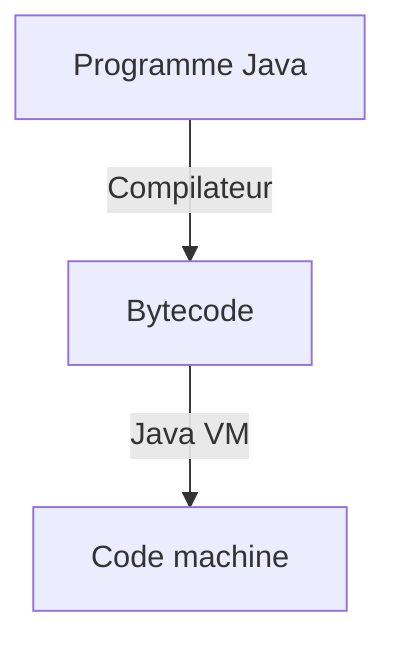

# Core

## Point d'entrée

`main()` => point d'entrée du programme Java

```java
// class Main
public class Main {
    // fonction main()
	public static void main(String[] args){

	}
}
```

## Commentaire

```java
// commentaire one line

/*
  commentaire
  ligne
  multiple
*/
```

---

## Compilateur

Java est un langage multiplateforme. Chaque classe est compilé séparément en code intermédiaire spéciale **bytecode**. La compilation en code machine s'effectue au lancement du programme.

Le programme Java Virtuel Machine (**JVM**) viens compiler le bytecode en code machine.



---

## Mémoire

### Organisation de la mémoire

Un programme est chargé en mémoire vive avant son exécution. La mémoire vive contient le code du programme (exécuté par le processeur), et les données du programme.

Le programme est ses données sont stockées en mémoire pendant l'exécutution. Toute la mémoire de l'ordinateur est représentée sous forme de "case", les octets. Chaque case possède sont numéro unique, la numérotation commence à zéro. Le numéro d'une case est appelé adresse de la case.

Le processeur sait exécuter les instructions d'un programme chargé en mémoire.

Lorsqu'une variable est déclarée dans le code du programme, un bloc mémoire libre est alloué. Lors de la déclaration d'une variable, il faut indiquer quel type la variable contient afin de définir une taille pour le bloc mémoire.

L'adresse d'une variable est l'adresse de la première case du bloc de mémoire qui lui est alloué

Les programme Java n'ont pas le droit d'accéder directement à la mémoire. Toute la manipulation de la mémoire s'effectue uniquement via la `JVM`.

### Affectation

```java
int a = 10;
int b = a;
b = 20;
System.out.println(a); // 10
```

Lorsque l'on vient affecter une valeur, la valeur est copier. La modification effectuer sur l'une des variable n'affecte pas l'autre. Elles sont indépendante.

---

## Architecture de projet

### Dossier `src`

Dans ce dossier que l'on vient déclarer la logique du projet.

```tree
MyFirstProject/
├── .idea/           # fichiers de service d’IntelliJ IDEA, ne pas toucher
├── out/             # ici apparaissent les fichiers .class compilés
├── src/             # c’est ici que vit votre code source !
│   └── Main.java
├── MyFirstProject.iml
└── README.md
```

### Packages `package`

En Java, les classes sont regroupées par **packages**. C'est l'équivalent d'un dossier pour des classes.

Il permettent: 
- Eviter les conflits de noms
- Structurer logiquement le code: `com.codegym.tasks`, `com.mycompany.utils`
- Gérer l'accès aux classes et méthodes

### Déclaration de package 

Au début de chaque fichier Java, avant les `import` et `class`, on vient écrire cette ligne: 

```java
package com.codegym.lesson05;
```

Cette ligne indique que le fichier appartient au package indiqué.

Les dossiers doivent correspondre au nom du package. Si on écrit `package com.codegym.lesson05`, le chemin sera `src/com/codegym/lesson05/Main.java`

### Nom complet d'une classe 

Chaque classe se trouve dans un package. 
- La classe `System` se trouve dans le package `java.lang`. Son nom complet est `java.lang.System`

On peut venir utiliser son nom complet:

```java
java.util.Scanner sc = new java.util.Scanner(System.in);
String name = sc.nextLine();
System.out.println("Bonjour, " + name);
```

Le nom complet d'une classe doit être utilisé dans le cas où on utilise deux classes différente portant le même nom. Il sera nécessaire de préciser le package de la classe.

```java
java.util.Date d1 = new java.util.Date();
java.sql.Date d2 = new java.sql.Date(System.currentTimeMillis());
```

### Instruction `import`

L'instruction `import` permet de simplifier la synaxe d'importation de classe.

Il ne peut pas être utilisé dans une méthode, il est déclarer qu'au début du fichier. Il ne permet pas de charger les classes en mémoire, il indique seulement au compilateur où récupérer la classe.

```java
// importation de la classe
import java.util.Scanner;

// utilisation avec la syntaxe courte 
Scanner sc = new Scanner(System.in);
```

Lorsqu'un programme utilise de nombreuses classe d'un même package, on peut venir importer l'ensemble du package:

L'import ne permet d'importer que les classe du package, et pas les classes du sous package. Il sera nécessaire de les importer séparément.

```java
// import complet 
import.java.util.*;

Scanner sc = new Scanner(System.in);
ArrayList<String> list = new ArrayList<>();
```

## Classpath: comment Java recherche les classes

Le `classpath` est le chemin que Java parcourt pour trouver les classes lors du lancement du programme.

## Organisation du code 

En Java, chaque classe `public` soit dans un fichier séparé portant le même nom que la classe. Par exemple, une classe `Person` sera dans un fichier `Person.java`.

```java
// src/con/javarush/lesson05/Person.java

package com.codegym/lesson05;

public class Person {
  String name;
}
```

Pour le stockage des images, fichiers textes, on place ces éléments dans un dossier séparé: `ressources`, ou `res`.

Dans IntelliJ, on peut ajoute ce type de dossier avec un clic droit et **Mark Directory as -> Ressources Root**.

Le code Java peut accéder à ces fichiers via le `classpath`

```tree
MyFirstProject/
├── src/
│   └── com/javarush/lesson05/
│       └── Main.java
├── resources/
│   └── config.txt
```