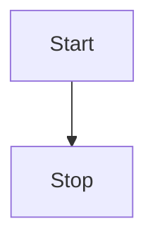
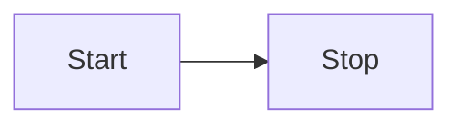
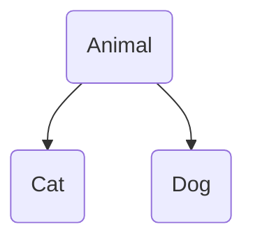

## Diagramme 

```
flowchart TD
    Start --> Stop
```



```
flowchart LR
    Start --> Stop
```



### Diagramme avec variable

```
flowchart TD
  A(Animal)
  B(Cat)
  C(Dog)
  
  A --> B
  A --> C 
```

